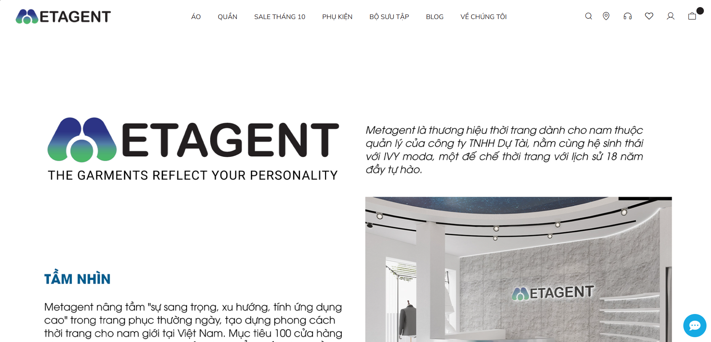
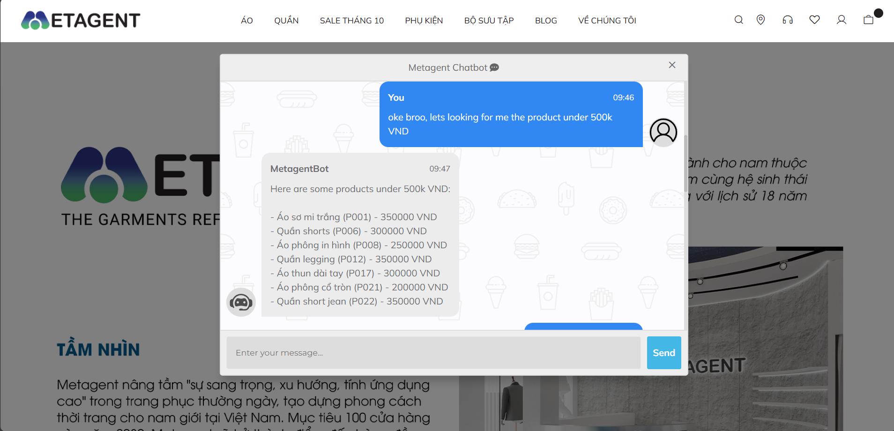
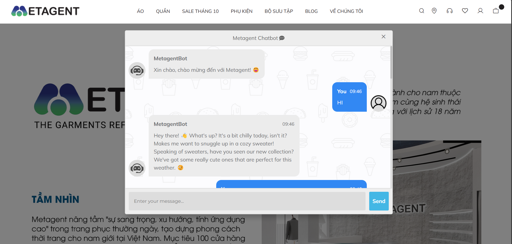

<h1 align="center">
  <br/>
  ShoppingGPT 🛍️
</h1>

<p align="center">
  <strong>The AI-native shopping assistant that actually understands your customers.</strong><br/>
  Powered by Google Gemini · LangChain Agents · Semantic Routing · RAG
</p>

<p align="center">
  <a href="#-quick-start"></a>
  <a href="#-architecture"></a>
  <a href="#-features"></a>
  
  
</p>

---

> **TL;DR** — ShoppingGPT is a production-ready, agentic AI chatbot for e-commerce. It routes every conversation through a semantic classifier, dispatches to specialized LangChain tools, and streams back intelligent responses — all in under a second.

---

## 🚀 The Problem We Solve

Generic chatbots give generic answers.  
Your customers ask *"Do you have a red linen shirt in size M under $40?"* and get *"Please visit our website."*

ShoppingGPT changes that. It understands intent, queries your live inventory with natural language, and replies like a seasoned sales associate — every single time.

---

## ✨ Features

| Capability | Detail |
|---|---|
| 🧠 **Gemini 1.5 Flash LLM** | Google's fastest production model for blazing response times |
| 🔀 **Semantic Router** | Classifies queries into `product` or `chitchat` in milliseconds |
| 🔍 **NL → SQL Product Search** | Converts plain English into optimised SQLite queries |
| 📜 **Policy RAG (FAISS)** | Retrieves relevant policy docs via vector similarity search |
| 💬 **Conversation Memory** | Full turn-by-turn context so nothing gets forgotten |
| 🌐 **Multi-language** | Responds in the same language the customer uses |
| ⚡ **Flask REST API** | Simple `/get` endpoint — drop into any frontend |
| 🔌 **LLM-Agnostic** | Swap Gemini for Groq / Llama3 with one line change |

---

## 🏗️ Architecture

```
Customer Message
      │
      ▼
┌─────────────────────┐
│   Semantic Router   │  ← HuggingFace embedding + cosine similarity
└──────┬──────────────┘
       │
  ┌────┴────┐
  │         │
  ▼         ▼
Chitchat  Shopping Agent (LangChain ReAct)
Chain           │
  │        ┌───┴───────────────┐
  │        │                   │
  │        ▼                   ▼
  │  Product Search      Policy Search
  │  (NL → SQL →         (FAISS Vector
  │   SQLite DB)          Similarity)
  │
  └──────────────────────────────────▶ Response
                                       + Memory Update
```

### Key Design Decisions

- **Semantic Router over keyword matching** — intent classification generalises to unseen phrasing.
- **NL → SQL via LLM** — no rigid query parser; handles complex multi-filter queries out of the box.
- **FAISS for policies** — sub-millisecond similarity search; no database round-trip.
- **Shared `ConversationBufferMemory`** — both the chitchat chain and shopping agent share context, so users don't have to repeat themselves.

---

## ⚡ Quick Start

### 1 · Clone

```bash
git clone https://github.com/yourusername/ShoppingGPT.git
cd ShoppingGPT
```

### 2 · Virtual Environment

```bash
python -m venv venv

# macOS / Linux
source venv/bin/activate

# Windows
venv\Scripts\activate
```

### 3 · Install Dependencies

```bash
pip install -r requirements.txt
```

### 4 · Configure Secrets

```bash
cp .env.example .env
# Open .env and paste your Google AI Studio API key
```

```env
GOOGLE_API_KEY=your_google_api_key_here
```

> Get your free key at [aistudio.google.com](https://aistudio.google.com)

### 5 · Run

**Web App (Flask)**
```bash
python app.py
# → http://localhost:5000
```

**CLI Mode**
```bash
python main.py
```

---

## 🗂️ Project Structure

```
ShoppingGPT/
├── app.py                        # Flask web server + request handler
├── main.py                       # Interactive CLI entry-point
├── requirements.txt
├── .env.example                  # Copy → .env and fill in keys
│
├── shoppinggpt/
│   ├── agent.py                  # LangChain ReAct Shopping Agent
│   ├── chain.py                  # Chitchat LLM chain
│   ├── config.py                 # Centralised config & path resolution
│   ├── router/
│   │   └── lib_semantic_router.py  # Semantic routing logic
│   └── tool/
│       ├── product_search.py     # NL → SQL → SQLite tool
│       └── policy_search.py      # FAISS policy retrieval tool
│
├── data/
│   ├── products.db               # SQLite product catalogue
│   ├── policy.txt                # Store policy document
│   └── datastore/                # FAISS index (auto-generated)
│
└── templates/
    └── index.html                # Chat UI
```

---

## 🧩 Data Schema

Products are stored in SQLite with the following schema:

| Column | Type | Description |
|---|---|---|
| `product_code` | TEXT | Unique SKU identifier |
| `product_name` | TEXT | Full product name |
| `material` | TEXT | Fabric / material composition |
| `size` | TEXT | Available sizes (S, M, L, XL…) |
| `color` | TEXT | Available colours |
| `brand` | TEXT | Brand or manufacturer |
| `gender` | TEXT | Target gender (male / female / unisex) |
| `stock_quantity` | INTEGER | Units in stock |
| `price` | REAL | Price in USD |

---

## 🔧 Customisation

### Swap the LLM

Open `main.py` (or `app.py`) and uncomment:

```python
# Gemini (default)
LLM = ChatGoogleGenerativeAI(temperature=0, model="gemini-1.5-flash")

# Groq / Llama3 (faster, free tier available)
from langchain_groq import ChatGroq
LLM = ChatGroq(temperature=0, model="llama3-8b-8192")
```

### Update Your Inventory

Replace `data/products.db` with your own SQLite database (keep the schema above).

### Update Store Policies

Edit `data/policy.txt` — the FAISS index rebuilds automatically on next run.

### Tune the Agent Persona

Modify `ShoppingAgent.SYSTEM_PROMPT` in `shoppinggpt/agent.py`.

---

## 🤖 Example Conversations

```
You: Do you have any blue denim jackets?
ShoppingGPT: Yes! We have 3 blue denim jackets in stock:
  • Levi's Classic Denim Jacket — M, L, XL — $59.99
  • H&M Slim Denim Jacket — S, M — $34.99
  • Wrangler Heritage Jacket — L, XL, XXL — $74.99
  Would you like more details on any of these?

You: What's your return policy?
ShoppingGPT: We offer a hassle-free 30-day return policy on all items.
  Products must be unworn with original tags attached...

You: It's raining today 😅
ShoppingGPT: Perfect weather to stay stylish! Have you seen our new
  waterproof trench coat collection? They're a bestseller this season ☔
```

---

## 📸 Screenshots


*Clean, minimal chat UI*


*Real-time product search results*


*Context-aware casual conversation*

---

## 🤝 Contributing

Pull requests are welcome! Here's how to contribute:

```bash
# 1. Fork the repository
# 2. Create your feature branch
git checkout -b feature/your-feature-name

# 3. Commit with a meaningful message
git commit -m "feat: add cart management tool"

# 4. Push and open a PR
git push origin feature/your-feature-name
```

Please follow [Conventional Commits](https://www.conventionalcommits.org/) and update tests where applicable.

---

## 🧠 Model

The custom text classification model powering the semantic router:

**[hang1704/opendaisy](https://huggingface.co/hang1704/opendaisy)** on Hugging Face  
Fine-tuned to classify queries as `chitchat` or `product` — feel free to fork it.

---

## 📄 License

MIT © 2024 — see [LICENSE](LICENSE) for details.

---

## 🙏 Acknowledgements

- [LangChain](https://github.com/langchain-ai/langchain) — the agent orchestration backbone
- [Google Generative AI](https://ai.google.dev/) — Gemini LLM + embeddings
- [Semantic Router](https://github.com/aurelio-labs/semantic-router) — blazing-fast query routing
- [FAISS](https://github.com/facebookresearch/faiss) — vector similarity at scale

---

<p align="center">
  Built with ❤️ · <strong>ShoppingGPT</strong> — Because your customers deserve better than keyword search.
</p>

---

---

---

---

---

## Author & Contact

- **Author:** Muhammad Shamim
- **GitHub:** [@m-shamim09](https://github.com/m-shamim09)
- **Email:** [mshamim.work@gmail.com](mailto:mshamim.work@gmail.com)
- **Profile:** https://github.com/m-shamim09

